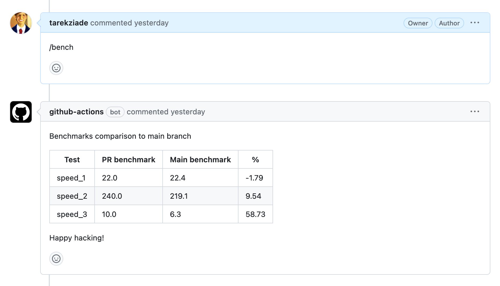

# alwaysfast

Github Action for continuous benchmarking.

This action is highly inspired from https://github.com/benchmark-action/github-action-benchmark
but is branch-aware and uses a time-series database.

The key differences are:

- metrics are stored in InfluxDB or Prometheus instead of a single JSON file
- you can run the action from a PR comment to get a diff with `main`
- the diff is made with the 10 last metrics from main to reduce noise and false positives.

Example of comments in the PR:



Example of usage:

```yaml
name: Test Action
on:
  push:
    branches:
      - main
  issue_comment:
    types: [created]

permissions: write-all

jobs:
  check-perf-main:
    if: github.event_name == 'push'
    name: Record performance on main
    runs-on: ubuntu-latest
    steps:
      - name: Checkout the repository
        uses: actions/checkout@v3
      - name: Run the bench
        run: python demo.py
      - name: Check perf
        uses: ./ # Uses an action in the root directory
        with:
          metrics_file: metrics.json
          influxdb_url: ${{ secrets.INFLUXDB_SERVER }}
          influxdb_token: ${{ secrets.INFLUXDB_TOKEN }}
          influxdb_org: tarek
          influxdb_bucket: benchmarks
  check-perf-pr:
    if: github.event.issue.pull_request && contains(github.event.comment.body, '/bench')
    runs-on: ubuntu-latest
    name: Check performance on the PR
    steps:
      - name: Get PR branch
        uses: xt0rted/pull-request-comment-branch@v1
        id: comment-branch
      - uses: actions/checkout@v3
        if: success()
        with:
          ref: ${{ steps.comment-branch.outputs.head_ref }}
      - name: Run the bench
        run: python demo.py
      - name: Check perf
        uses: ./ # Uses an action in the root directory
        with:
          metrics_file: metrics.json
          head_ref: ${{ steps.comment-branch.outputs.head_ref }}
          influxdb_url: ${{ secrets.INFLUXDB_SERVER }}
          influxdb_token: ${{ secrets.INFLUXDB_TOKEN }}
          influxdb_org: tarek
          influxdb_bucket: benchmarks
```
